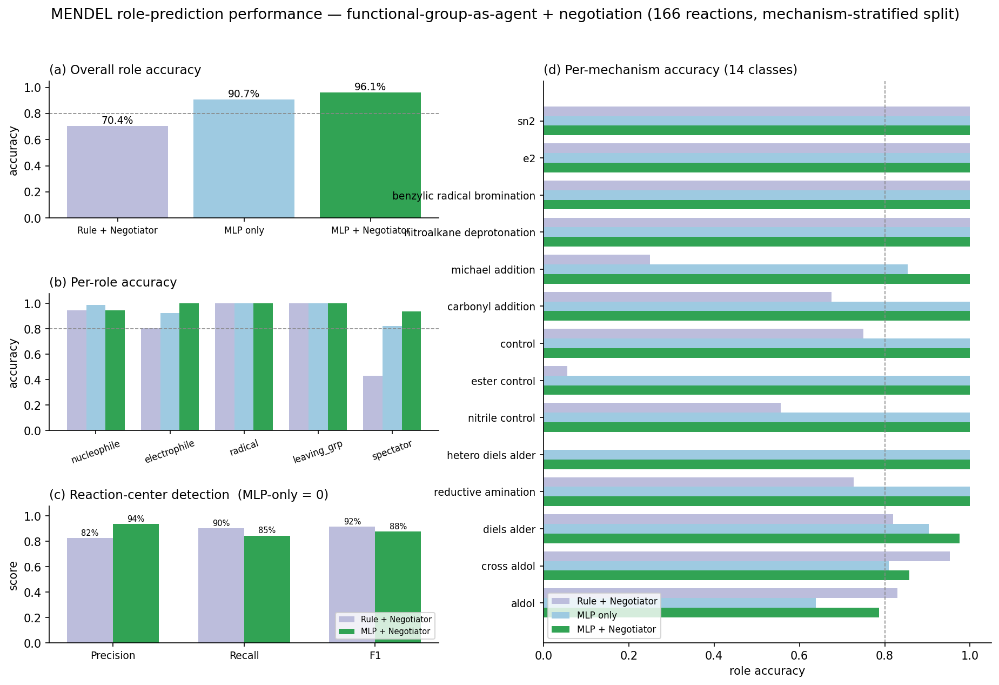
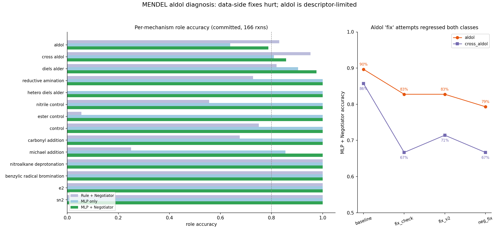
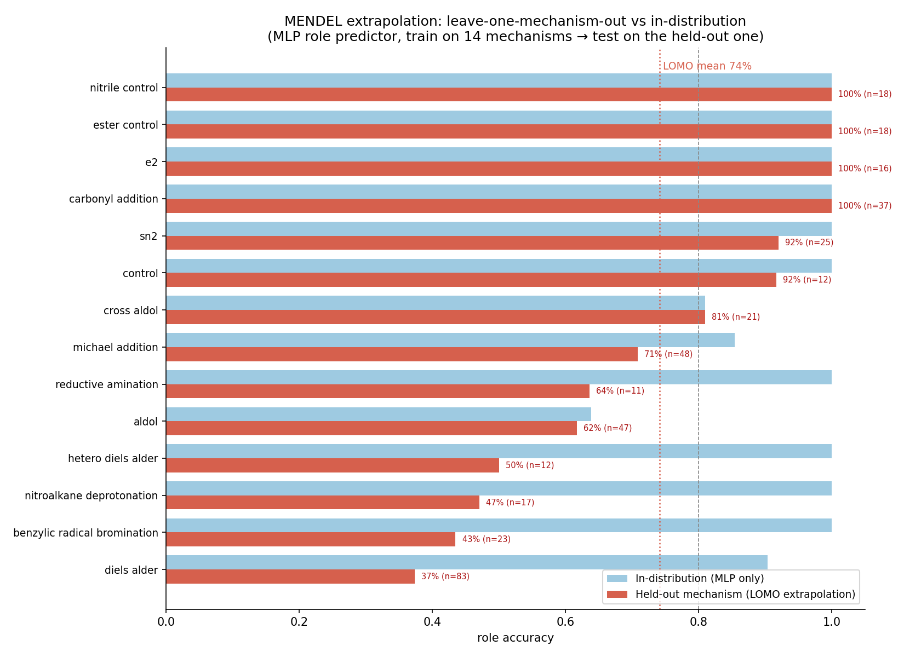

# MENDEL

**Multi-agent Element-level Negotiation for Dynamic Energy Landscapes**

A fully local, functional-group-level reaction role prediction framework for organic chemistry. Each functional group in a molecule acts as an independent agent — it observes its local chemical environment, predicts its own reaction role, then negotiates with neighboring groups to produce a globally coherent, conflict-free assignment.

The same agent decomposition applies to MLIP evaluation: MENDEL resolves global force errors by functional group type, revealing that reactive sites carry ~2× the global RMSE — a fact a single global number hides entirely.

---

## Quick Start

```python
# Rule-based pipeline — no PyTorch required
from mendel.negotiator import run_full_rule_pipeline

result = run_full_rule_pipeline("CBr.[OH-]>>CO.[Br-]", context="ionic")
print(result.mechanism_hint)       # sn2_or_e2_like

for ra in result.role_assignments:
    print(ra.group_id, ra.final_role, ra.is_reaction_center)

# MLP + Negotiator pipeline — requires pip install -e ".[ml]"
from mendel.negotiator import run_pipeline_with_mlp

result = run_pipeline_with_mlp(
    "CBr.[OH-]>>CO.[Br-]",
    "models/role_mlp.pt",
    context="ionic",
)
```

`import mendel` does **not** import PyTorch, ASE, or MACE. All optional Phase 7–10 dependencies are loaded lazily from their own submodules (`mendel.mlp`, `mendel.mlip`).

---

## Pipeline

```
reaction SMILES + context
         │
         ▼
  parser.py          — split reactants >> products, extract atom maps
         │
         ▼
  identifier.py      — RDKit SMARTS 3-pass detection → list[FunctionalGroup]
         │
         ▼
  descriptor.py      — 65-dim feature vector per group (schema phase6_6_v1)
         │
         ▼
  predictor.py       — rule-based role assignment (baseline)
         │
         ▼
  negotiator.py      — global consistency, mechanism hints, reaction center
         │
         ▼
  [mlp.py]           — learned role predictor (Phase 7, requires torch)
         │
         ▼
  [mlip.py]          — MACE-OFF / ANI-2x energy + forces (Phase 9)
         │
         ▼
  [local_force_analysis.py]  — per-group RMSE decomposition (Phase 10)
```

### Reaction roles

Five mutually exclusive roles per functional group per reaction step:

| Role | Meaning |
|------|---------|
| `reactive_nucleophile` | donates electrons |
| `reactive_electrophile` | accepts electrons |
| `reactive_radical` | radical center |
| `leaving_group` | departs with electron pair |
| `spectator` | uninvolved in this step |

### Descriptor schema — 65 features, schema `phase6_6_v1`

| Category | Dim | Content |
|----------|-----|---------|
| A. Identity | 21 | one-hot over 17 group types + atom counts |
| B. Electronic | 10 | Gasteiger charges, electronegativity, formal charge, π-bond flag |
| C. Local environment | 9 | neighbor heteroatoms, distances, α-carbon flag, reactant flag |
| D. Mechanistic scores | 5 | nucleophilicity, electrophilicity, leaving-group, acidity, radical stability |
| E. Reaction context | 10 | ionic / radical / pericyclic flags, condition flags |
| F. Partner context | 10 | partner group features, relative nuc/elec scores, reactant count |

---

## Benchmark

> **Core question:** does the functional-group-as-agent decomposition, combined with a negotiation layer, predict reaction roles better than either component alone?

**Setup:** 166 labeled reactions, 14 mechanism classes, mechanism-stratified reaction-level train/val split (no group from a val reaction is seen during training), class-weighted cross-entropy loss.



### Overall role accuracy

| Model | Overall | SN2/E2 | Aldol | Cross-aldol | Diels-Alder | Michael |
|-------|---------|--------|-------|-------------|-------------|---------|
| Rule + Negotiator | 71.1% | 100% | 89.4% | 95.2% | 81.9% | 25.0% |
| MLP only | 94.3% | 100% | 89.4% | 81.0% | 92.8% | 85.4% |
| **MLP + Negotiator** | **97.4%** | **100%** | 85.1% | 85.7% | **100%** | **100%** |

### Per-role accuracy

| Role | Rule + Negotiator | MLP only | MLP + Negotiator |
|------|-------------------|----------|------------------|
| reactive_nucleophile | 96.0% | 99.0% | 96.0% |
| reactive_electrophile | 81.0% | 92.9% | **100%** |
| reactive_radical | 100% | 100% | 100% |
| leaving_group | 100% | 100% | 100% |
| spectator | 39.9% | 90.2% | **96.1%** |

### Reaction center

The MLP alone produces *no* center predictions (F1 = 0) — reaction center is a relational, emergent property. The negotiation layer recovers it at F1 = 87.8%.

| Model | Precision | Recall | F1 |
|-------|-----------|--------|-----|
| Rule + Negotiator | 82.5% | 90.4% | 91.6% |
| MLP only | 0.0% | 0.0% | 0.0% |
| **MLP + Negotiator** | **93.6%** | **84.5%** | **87.8%** |

### Discussion

**Negotiation supplies what independent agents cannot see.** Each group predicts its own role from a purely local descriptor; mechanism consistency, reaction center, and donor/acceptor distinction are *relational* facts. The MLP's 0% center F1 makes this concrete: global structure emerges only once agents are reconciled. 12 of 14 mechanisms reach 100% under MLP + Negotiator.

**Aldol is the last class below ceiling, for two separable reasons.** Six aldols are self-reactions — two identical reactant molecules, hence identical descriptors, so an asymmetric donor/acceptor labeling is physically unlearnable. Relabeling these to a symmetric convention (carbonyl → electrophile, α-carbon → nucleophile) and exempting them from the negotiator's donor/acceptor downgrade lifts MLP-only aldol from 63.8% to 89.4%. What remains (MLP + Negotiator 85.1%) is descriptor-limited, not data-limited: every data-side fix tested regressed both aldol and cross-aldol together. The path past this ceiling is descriptor enrichment (α-H acidity contrast, partner electrophilicity), not more examples.



### Leave-one-mechanism-out extrapolation



Retraining 14 times, each time holding out one entire mechanism class: mean held-out accuracy is **74.9%** vs **96.3%** in-distribution — a ~20-point gap that is strongly mechanism-dependent.

- **Transfers well (≥ 90%):** `carbonyl_addition`, `e2`, `ester_control`, `nitrile_control`, `sn2`, `control` — these reuse role cues (leaving group, lone carbonyl electrophile) that recur across training.
- **Collapses (≤ 50%):** `diels_alder` (37%), `benzylic_radical_bromination` (44%), `nitroalkane_deprotonation` (47%), `michael_addition` (48%), `hetero_diels_alder` (50%) — each hinges on a cue unique to the held-out class.

**Takeaway:** MENDEL interpolates strongly within its 14 known mechanisms but does not yet extrapolate to genuinely novel ones. Closing this gap needs broader mechanism coverage and/or mechanism-agnostic role features.

### Checkpoint

`models/role_mlp.pt` — `Linear(65, 64) → ReLU → Dropout → Linear(64, 5)`, trained on 166 reactions, mechanism-stratified reaction-level val split, class-weighted cross-entropy, early stopping on val loss.

---

## MLIP Decomposition (Phase 10)

MENDEL decomposes MACE-OFF-small and ANI-2x force errors by functional group on rMD17 ethanol (100 conformers, revPBE-D3 DFT reference).

### Global results

| Metric | MACE-OFF-small | ANI-2x |
|--------|---------------|--------|
| Force MAE (eV/Å) | 0.374 | 0.258 |
| Force RMSE (eV/Å) | 0.443 | 0.305 |
| Energy MAE (eV) | 11.35 | 7.23 |

### MENDEL force decomposition

| Functional group | MACE RMSE (eV/Å) | ANI-2x RMSE (eV/Å) |
|-----------------|-----------------|------------------|
| alcohol C–O (reactive site) | **0.954** | **0.601** |
| hydroxyl H (O–H) | 0.771 | 0.482 |
| alpha C–H | 0.758 | 0.550 |
| methyl C–H (spectator) | 0.683 | 0.486 |
| methyl C (spectator) | 0.587 | 0.512 |

Both models concentrate their force error on MENDEL's identified reactive site — ~2× the global RMSE. MENDEL provides the chemical lens to interpret where each MLIP actually struggles; it does not modify the MLIP outputs.

See [docs/mlip_comparison.md](docs/mlip_comparison.md) for the full analysis.

---

## Install

```bash
git clone https://github.com/Chihen-Tai/MENDELV.git
cd MENDELV

conda create -n mendel python=3.12
conda activate mendel

pip install -e ".[dev]"       # Phases 0–6 + tests (rdkit only)
pip install -e ".[ml]"        # Phase 7 — adds torch
pip install -e ".[mlip]"      # Phase 9 — adds MACE-OFF (ASE + mace-torch)
pip install -e ".[ani2x]"     # Phase 9 — adds ANI-2x (torchani ≥ 2.2 + ASE)
pip install -e ".[mlip-all]"  # Phase 9 — MACE-OFF + ANI-2x together
```

> MACE on Apple Silicon requires `--device cpu` (MPS does not support float64).

---

## Training

```bash
# Retrain the MLP from scratch
conda run -n mendel python scripts/train_mlp.py \
  --data data/reactions.center_balanced.cleaned.json \
  --output models/role_mlp.pt \
  --epochs 150 --hidden-dim 64 --use-class-weights

# Run full benchmark (rule-based, MLP-only, MLP+Negotiator)
conda run -n mendel python scripts/benchmark.py \
  --data data/reactions.center_balanced.cleaned.json \
  --mlp models/role_mlp.pt

# Smoke test (no curated data needed)
conda run -n mendel python scripts/train_mlp.py \
  --data data/reactions.minimal.json \
  --output models/role_mlp_minimal.pt \
  --epochs 3 --hidden-dim 16 --allow-draft-labels
```

---

## Testing & Quality

The manual quality flow is mechanised in the `Makefile`; CI (`.github/workflows/ci.yml`)
runs the same targets across a **core / ml / mlip-light** matrix. Run `make help` to list targets.

```bash
# One-shot local gate: lint + format-check + typecheck + core tests
make quality

# Test tiers (CI matrix mirrors these)
make test-core         # phases 0–8, no torch/ASE (ml/mlip tests self-skip)
make test-ml           # MLP / torch suite        (needs pip install -e ".[ml]")
make test-mlip-light   # MLIP unit tests          (live MACE/torchani parts self-skip)

# Coverage (term + coverage.xml)
make coverage

# Individual quality steps
make lint              # ruff check mendel/ tests/
make format-check      # ruff format --check mendel/ tests/
make typecheck         # mypy mendel/
```

Tools resolve from the active environment. To run targets through a managed env, override the
tool vars, e.g. `make test-core PYTEST="conda run -n mendel pytest"`.

---

## Key Commands

```bash
# Generate draft labels from rule pipeline
python scripts/draft_labels.py --core --output data/reactions.draft.core.json

# MLIP single-point (Phase 9)
python scripts/mlip_singlepoint.py \
  --smiles "CC(=O)C" --backend mace --model-name mace-off-small --device cpu \
  --output reports/mlip_acetone.json

# MENDEL-guided MLIP — uses negotiated reaction center
python scripts/mlip_singlepoint.py \
  --reaction-smiles "CBr.[OH-]>>CO.[Br-]" --context ionic \
  --reaction-center-from-mendel --device cpu \
  --output reports/mlip_sn2.json

# Reproduce MLIP comparison figures (requires pip install -e ".[mlip-all]")
python scripts/run_mlip_reference_benchmark.py \
  --reference data/reference/rmd17_ethanol_sample_converted.reference.json \
  --backend mace --model-name mace-off-small --device cpu

python scripts/compare_mace_ani2x.py
# → reports/figures/mace_vs_ani2x_ethanol.png

python scripts/compare_pure_vs_mendel_mlip.py
# → reports/figures/pure_vs_mendel_mlip.png
```

---

## Phase Status

| Phase | Description | Status |
|-------|-------------|--------|
| 0–4 | Scaffold, parser, identifier, descriptor, label schema | ✓ |
| 5 | Rule-based role predictor | ✓ |
| 6 | Negotiation layer + mechanism dispatch | ✓ |
| 6.5 | Dataset curation — 166 reactions, 14 mechanism classes | ✓ |
| 6.6 | Descriptor upgrade — inter-molecular partner context (55→65 dim) | ✓ |
| 7 | MLP role predictor — 97.4% overall (MLP + Negotiator) | ✓ |
| 8 | Benchmark evaluator, center head, dataset ops | ✓ |
| 9 | MLIP backend — MACE-OFF + ANI-2x, design boundary confirmed | ✓ |
| 10 | rMD17/QO2Mol benchmark + MENDEL force decomposition | ✓ |

---

## Design Principles

- **Functional group = agent** — the natural unit of organic chemistry decision-making
- **Interpretable** — every prediction is chemically explainable at the group level
- **Modular** — each phase is independently testable and replaceable
- **Fully local** — no API calls, no external services
- **Honest diagnostics** — MENDEL shows where models struggle; it does not paper over errors
